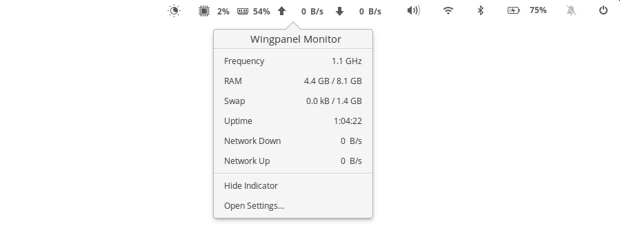

<p align="center">
  
</p>
<h1 align="center">Wingpanel Monitor</h1>

<!-- <p align="center">
  <a href="https://appcenter.elementary.io/com.github.plugarut.wingpanel-monitor"></a>
</p> -->




## Building and Installation

You'll need the following dependencies:

```
libglib2.0-dev
libgtop2-dev
libgranite-dev
libgtk-3-dev
libwingpanel-2.0-dev
libgeoclue-2-dev
libgweather-3-dev
meson
valac
```

You can install them running
```
sudo apt install libgtop2-dev libgranite-dev libgtk-3-dev libwingpanel-2.0-dev meson valac libgeoclue-2-dev libgweather-3-dev
```

Run `meson` to configure the build environment and then `ninja` to build

```
meson build --prefix=/usr
cd build
ninja
```

To install, use `ninja install`

```
sudo ninja install
com.github.plugarut.wingpanel-monitor
```

## Special Thanks
 - [Nararyans R.I.](https://github.com/Fatih20) for the icon
