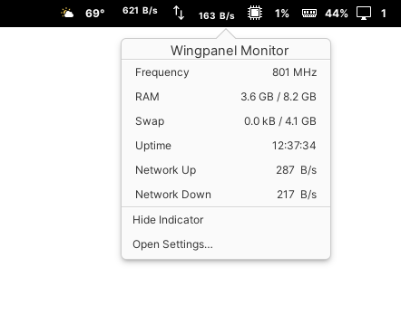

# Wingpanel Monitor

[](https://travis-ci.org/PlugaruT/wingpanel-monitor)

This application is supposed to replace [this indicator](https://github.com/PlugaruT/wingpanel-indicator-sys-monitor). It is still a **WIP!**




## Building and Installation

You'll need the following dependencies:

```
libglib2.0-dev
libgtop2-dev
libgranite-dev
libgtk-3-dev
libwingpanel-2.0-dev
meson
valac
```

You can install them running
```
sudo apt install libgtop2-dev libgranite-dev libgtk-3-dev libwingpanel-2.0-dev meson valac
```

Run `meson` to configure the build environment and then `ninja` to build

```
meson build --prefix=/usr
cd build
ninja
```

To install, use `ninja install`

```
ninja install
```